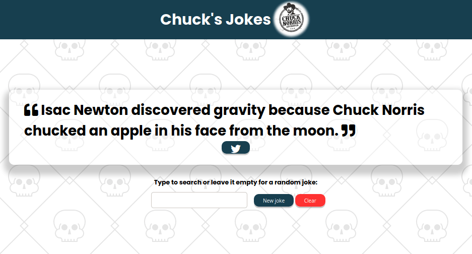

# Chuck's Jokes 🤠

This is a simple JavaScript app that uses the [chucknorris.io](https://api.chucknorris.io/) API to fetch a random Chuck Norris joke.

It is possible to search for a joke that contains a specific term.

## Screenshot

## Prerequisites

There is no prerequisites. Just browse to the URL and have some fun!

## Using Chuck's Jokes

Just browse to: https://chucks-jokes.netlify.app/

## Contributing to Chuck's Jokes
To contribute to chucks-jokes, follow these steps:

1. Fork this repository.
2. Create a branch: `git checkout -b <branch_name>`.
3. Make your changes and commit them: `git commit -m '<commit_message>'`
4. Push to the original branch: `git push origin chucks-jokes/<location>`
5. Create the pull request.

Alternatively see the GitHub documentation on [creating a pull request](https://help.github.com/en/github/collaborating-with-issues-and-pull-requests/creating-a-pull-request).

## Maintainer & Contributors
* [@guinuxbr](https://github.com/guinuxbr)

## Contact
If you want to contact me you can send an email to guinuxbr@gmail.com.

## License
This project uses the following license: [GNU GPLv3](https://www.gnu.org/licenses/gpl-3.0.html).
